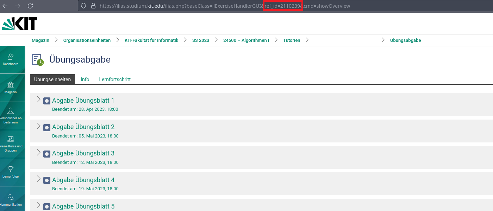

# IliasUploaderUtility
*Because Ilias is a UX Nightmare*

---
A tool to upload files to (KIT-)Ilias

## Installation
Either
- Download the binary from the releases page
- Clone the repo and run `cargo install` (obviously requires [cargo](https://github.com/rust-lang/cargo))
- Use nix flakes: `nix run github:Mr-Pine/IliasUploaderUtility`

If you are on windows you can also add a context menu entry `upload to ilias` to the explorer by executing [`windows_contextmenu.reg`](./windows_contextmenu.reg)

## Usage
### CLI
To upload a file to ilias run `ilias_uploader_utility --ilias-id [The ref_id of the ilias Upload page (see below)] --username [your u-Name] --password [mySuperS3curePassw0rd1337]`. If you don't provide a password it will prompt you and save it to your system's keyring.

### Config files
You can also provide config files by putting a file named `.ilias_upload` ([See example](./.ilias_upload)) in the same, or a parent-, directory as where you execute the command. The default search depth is `3`, meaning it will search `.`. `..`, `../..`. You can change the depth by providing `-d [your favorite depth]`

#### Options
The following config options are available

- `username`: Your shibboleth username (uxxxx)
- `ilias_id`: The id of the Ilias object you want to upload to 

Finding the id
 

- `preselect_delete` - `ALL|SMART|NONE`: When overwriting files select what files should be preselected to be deleted, `SMART` selects files with the same name
- `transform_regex`, `transform_format`: Regex transforms to run on each filename before uploading. Uses the syntax from [`Regex::replace_all` from the `regex` crate](https://docs.rs/regex/latest/regex/struct.Regex.html#method.replace_all)
- `upload_type` - `EXERCISE|FOLDER`: What kind of target you want to upload to. Chose `EXERCISE` for submitting solutions and `FOLDER` for uploading slides and other material to a course
